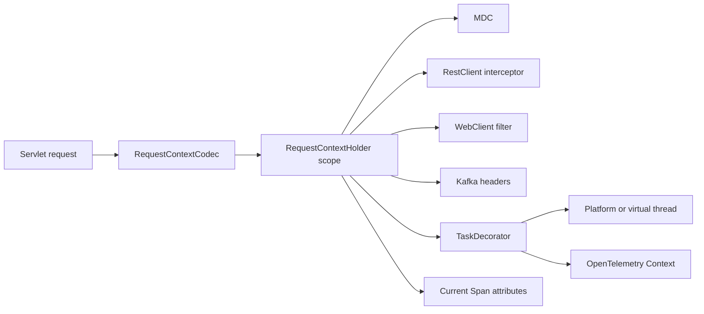
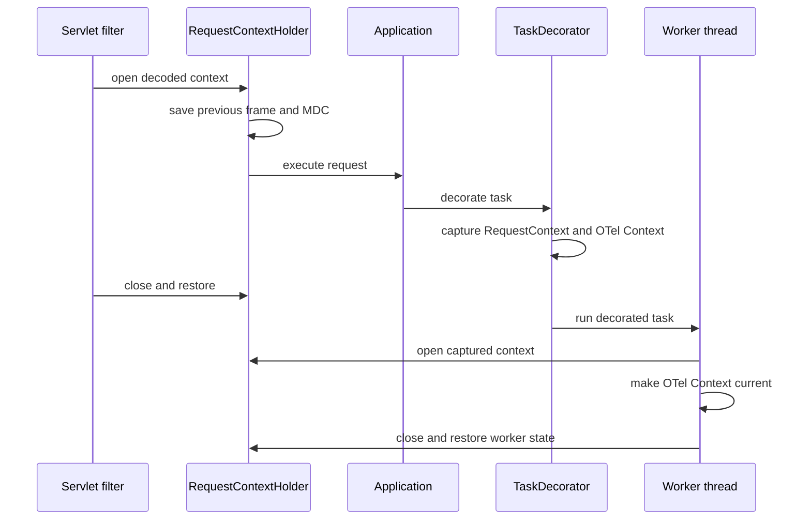

# Spring Context Propagation

Typed request and execution context propagation across Servlet, HTTP client, Kafka, executor, virtual-thread, Reactor, MDC, and OpenTelemetry boundaries.

## Problem Statement

Correlation, tenant, user, locale, deadline, and trace context often disappear when work moves from an inbound request to an executor, HTTP client, Kafka record, reactive subscription, or another thread. Ad hoc headers and inheritable thread-local state create inconsistent behavior and can leak one request's identity into unrelated work.

## What This Project Solves

Spring Context Propagation provides one immutable `RequestContext`, a strict lexical scope, and adapters for common Spring boundaries. Every installed scope must close on its owner thread and in LIFO order. Closing restores both the previous request context and the previous MDC map.

The library includes correlation/request/tenant/user IDs, locale, deadline, safe header encoding, Servlet lifecycle management, RestClient and WebClient propagation, Reactor context support, Kafka headers, Spring `TaskDecorator`, virtual-thread behavior, MDC cleanup, and OpenTelemetry context capture.

## When To Use It

Use this library when a Spring application needs the same small set of request metadata at service boundaries, logs, asynchronous tasks, or outgoing calls. It is particularly useful in multi-tenant services and request flows with explicit deadlines.

Do not place domain entities, credentials, mutable collections, or arbitrary business objects in `RequestContext`. Pass business data through method parameters or messages.

## Architecture / HLD



The holder uses a plain, non-inheritable `ThreadLocal`. Propagation happens only through explicit boundary adapters. This prevents child threads from silently inheriting stale identities and makes cleanup observable in code and tests.

## Detailed Design / LLD



Nested scopes form a linked stack. Closing out of order or on another thread throws rather than silently corrupting context. A second close is idempotent.

## Public API / API Structure

| API | Responsibility |
| --- | --- |
| `RequestContext` | Immutable metadata and deadline helpers |
| `RequestContextHolder` | Current lookup and lexical `Scope` |
| `RequestContextCodec`, `RequestContextHeaders` | Header encoding, decoding, and names |
| `RequestContextServletFilter` | Inbound Servlet lifecycle |
| `RequestContextRestClientInterceptor` | RestClient-compatible outgoing headers |
| `RequestContextWebClientFilter`, `ReactorRequestContext` | Imperative and reactive WebClient propagation |
| `KafkaRequestContextPropagator` | Producer injection and consumer scope |
| `RequestContextTaskDecorator` | Executor, `@Async`, platform-thread, virtual-thread, and trace propagation |
| `OpenTelemetryRequestContextBridge` | Current span enrichment |

## Core Concepts

Install context only around the work that owns it:

```java
try (RequestContextHolder.Scope ignored = RequestContextHolder.open(context)) {
    service.handle();
}
```

The scope restores any outer context and the complete prior MDC map. `requireCurrent()` fails explicitly when no context exists; `current()` returns an `Optional`.

Deadlines are absolute UTC `Instant` values carried in `X-Request-Deadline`. `isExpired(clock)` treats the exact boundary as expired. `remaining(clock)` returns zero after expiration and a large duration when no deadline exists. Applications translate remaining duration into client-specific timeouts.

For reactive subscriptions, put the typed value in Reactor context:

```java
webClient.get()
    .uri("/resource")
    .retrieve()
    .bodyToMono(Result.class)
    .contextWrite(ReactorRequestContext.write(requestContext));
```

WebClient reads Reactor context first and the captured imperative context second, avoiding assumptions about subscriber threads.

## Local Prerequisites

- JDK 21 or newer
- Git
- No broker, HTTP server, or telemetry backend is needed for tests

## Steps To Run

```bash
git clone https://github.com/aniket-deshkar/spring-context-propagation.git
cd spring-context-propagation
./mvnw verify
```

On Windows use `.\mvnw.cmd verify`.

## Configuration

```yaml
spring:
  context-propagation:
    enabled: true
```

`spring.context-propagation.enabled` defaults to `true`. The default codec generates UUIDs for missing correlation and request IDs. Define a custom `RequestContextCodec` bean to use another ID source or inbound trust policy.

## Usage Examples

Create an explicit context:

```java
RequestContext context = new RequestContext(
    "correlation-42", "request-99", "tenant-north", "user-7",
    Locale.CANADA_FRENCH, Instant.now().plusSeconds(10));
```

Configure an executor:

```java
@Bean
ThreadPoolTaskExecutor applicationExecutor(RequestContextTaskDecorator decorator) {
    ThreadPoolTaskExecutor executor = new ThreadPoolTaskExecutor();
    executor.setTaskDecorator(decorator);
    executor.initialize();
    return executor;
}
```

The same decorator works with virtual-thread executors because it installs context inside each submitted task and removes it afterward.

Configure clients:

```java
RestClient restClient = RestClient.builder()
    .requestInterceptor(restClientInterceptor).build();
WebClient webClient = WebClient.builder().filter(webClientFilter).build();
```

Propagate Kafka records:

```java
ProducerRecord<String, Event> outgoing = propagator.inject(record);
try (RequestContextHolder.Scope ignored = propagator.open(incomingRecord)) {
    handler.accept(incomingRecord.value());
}
```

Enrich a span after authentication supplies trusted identity:

```java
openTelemetryBridge.enrichCurrentSpan(RequestContextHolder.requireCurrent());
```

## Testing

`./mvnw verify` covers nested scopes, MDC restoration, LIFO enforcement, malformed deadlines, header injection, deadline boundaries, Servlet success/failure cleanup, RestClient, WebClient imperative and Reactor contexts, Kafka round trips, executor reuse, virtual threads, OpenTelemetry context capture, and auto-configuration.

Tests submit unrelated work to the same worker after a contextual task and confirm that no request context remains.

## Observability

The holder projects `correlationId`, `requestId`, `tenantId`, and `userId` into MDC for the active scope. It restores the entire prior MDC map on close rather than clearing keys owned by another library.

The OpenTelemetry bridge adds IDs, locale, and deadline to the current span. The task decorator captures `io.opentelemetry.context.Context.current()` alongside request context, preserving the active trace across executor boundaries and integrating naturally with `spring-ai-otel-starter`.

## Security

- Treat inbound tenant and user headers as untrusted unless an authenticated gateway overwrites them.
- Identifiers reject control characters and values longer than 128 characters.
- The Servlet filter returns HTTP 400 for invalid context headers.
- Do not propagate credentials or authorization decisions in `RequestContext`.
- Apply topic- and service-level authorization independently of identity hints.
- See [SECURITY.md](SECURITY.md) for private reporting.

## Repository Structure

```text
src/main/java/io/github/aniketdeshkar/context/
├── async/          task decoration and trace capture
├── autoconfigure/  Spring Boot beans and properties
├── kafka/          producer and consumer headers
├── otel/           current-span enrichment
├── web/            Servlet, RestClient, WebClient, and Reactor adapters
├── RequestContext.java
├── RequestContextCodec.java
└── RequestContextHolder.java
src/test/java/io/github/aniketdeshkar/context/
```

## Design Decisions / Trade-offs

- The context model is closed and typed. Adding a field requires an explicit compatibility decision instead of creating an unbounded map.
- A non-inheritable `ThreadLocal` requires adapters at each boundary but prevents accidental child-thread inheritance.
- Scope closure is strict about thread ownership and ordering, so programming errors fail close to their source.
- Kafka helpers mutate supplied record headers and remove duplicate context headers before injection.
- Deadline propagation does not enforce cancellation; each operation must apply its own timeout.

## Contributing

See [CONTRIBUTING.md](CONTRIBUTING.md). Boundary changes require both propagation and cleanup tests and must pass `./mvnw verify`.

## License

Licensed under the Apache License 2.0. See [LICENSE](LICENSE).
